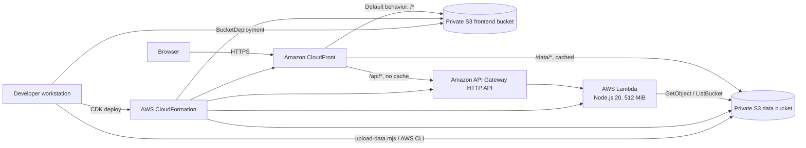
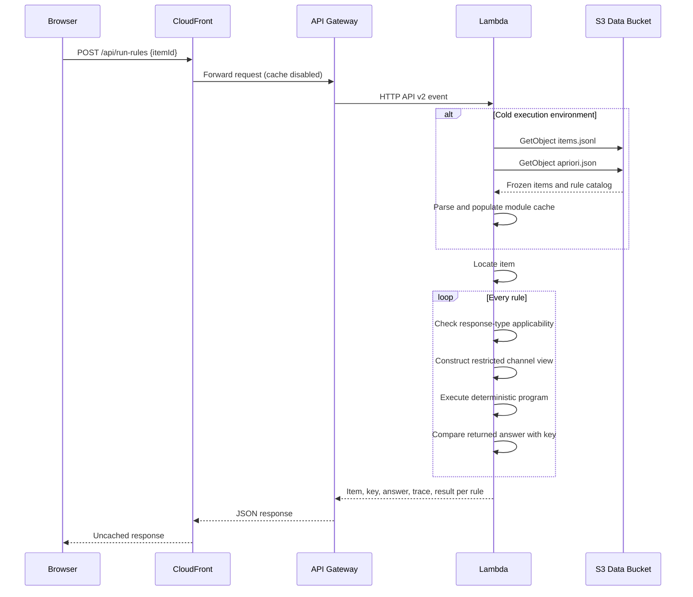
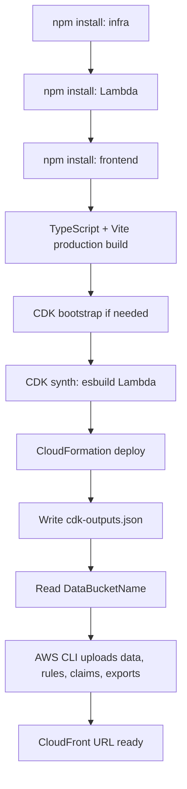

# CCF Live Demo — Technical Specification

**System:** Curriculum Claim Falsification live demo  
**Purpose:** CHAT: Minds and Machines university hackathon, September 2026  
**Status:** Deployed  
**Region:** `us-east-1`  
**Live application:** [https://d2nqjgx9lqdrd.cloudfront.net](https://d2nqjgx9lqdrd.cloudfront.net)  
**Direct API:** `https://4bbskj3on9.execute-api.us-east-1.amazonaws.com`  
**Infrastructure as code:** AWS CDK v2 in TypeScript

## 1. Executive Summary

The CCF live demo is a serverless web application for exploring whether assessment items actually require the skills their published tags claim. It combines a static, globally delivered React application with an on-demand Lambda API that executes 15 deterministic assessment-bypass programs against any of 2,405 released assessment items.

The architecture deliberately separates two workloads:

1. **Read-heavy research results** — pre-computed JSON files are stored in Amazon S3 and cached by Amazon CloudFront.
2. **Interactive computation** — a lightweight Node.js Lambda executes deterministic rules in real time behind Amazon API Gateway.

This hybrid design avoids running the complete research and GPU pipeline during a demo request. Visitors can browse existing results at CDN speed while still seeing genuine computation—not a prerecorded mock—when they open an item or rerun its rules.

The design optimizes for a short-lived hackathon environment:

- minimal operational overhead;
- no always-on servers;
- reproducible infrastructure from one CDK stack;
- fast deployment from a laptop;
- automatic resource cleanup;
- enough isolation to prevent direct public S3 access;
- intentionally simple public access for a demonstration audience.

It is not presented as a production multi-tenant service. Authentication, WAF policies, API throttling controls, custom-domain TLS, alarms, and a formal CI/CD pipeline are listed as production-hardening opportunities rather than hidden assumptions.

## 2. Goals and Non-Goals

### 2.1 Goals

- Make the 2,405-item frozen census easy to search and inspect.
- Surface existing witness records and explain the one-sided interpretation clearly.
- Execute all 15 a priori programs against an individual item on demand.
- Guarantee that an interactive program receives a restricted item view and never receives the published key through that view.
- Provide an inspectable trace for every attempted rule.
- Serve the application through one HTTPS CloudFront hostname.
- Keep the deployment fully reproducible with AWS CDK.
- Avoid Docker as a local deployment prerequisite.
- Support a no-AWS local development mode.
- Delete all application resources cleanly after the hackathon.

### 2.2 Non-Goals

- Rerun the full research census from the browser.
- Run Qwen, Phi-4, Mistral, or other GPU models in the request path.
- Implement the repository's unwired Bedrock backend.
- Accept item, rule, or claim mutations through a public API.
- Provide user accounts, role-based access control, or tenant isolation.
- Replace the paper's statistical pipeline or its frozen exports.
- Claim that a no-witness result validates an assessment tag.

## 3. Architecture Overview



### 3.1 Why this is a hybrid architecture

The user experience is dynamic, but most of the source material is immutable for the lifetime of the event. Putting the React bundle and research exports in S3/CloudFront gives static-hosting simplicity and CDN performance. Lambda is reserved for requests where computation adds explanatory value: filtering item metadata, joining witness rows, listing configuration, and running the rules.

This creates a useful architectural boundary:

- **Data plane for published results:** S3 + CloudFront.
- **Compute plane for demonstrations:** API Gateway + Lambda.
- **Deployment/control plane:** CDK + CloudFormation + AWS CLI.

## 4. Deployed AWS Resource Inventory

All resources are defined in `demo/infra/lib/ccf-demo-stack.ts` and deployed as the `CcfDemoStack` CloudFormation stack.

| Resource | Current identifier | Configuration | Responsibility |
|----------|--------------------|---------------|----------------|
| CloudFront distribution | `d2nqjgx9lqdrd.cloudfront.net` | HTTPS redirect; three origin behaviors; SPA error mapping | Single public entry point and CDN |
| Frontend S3 bucket | `ccfdemostack-frontendbucketefe2e19c-3pern1x4os7i` | Private; public access blocked; auto-delete | React production assets |
| Data S3 bucket | `ccfdemostack-databuckete3889a50-79fgzienojtx` | Private; public access blocked; GET CORS; auto-delete | Items, rules, claims, witnesses, summaries |
| API Gateway | API ID `4bbskj3on9` | HTTP API; public; GET/POST CORS | Routes `/api/*` to one Lambda integration |
| Lambda function | CloudFormation-generated name | Node.js 20; 512 MiB; 15 s timeout | Item queries and deterministic rule execution |
| IAM execution role/policy | CloudFormation-generated | Lambda basic execution plus read-only data-bucket access | Least-privilege runtime access |
| CloudFront OAI | CloudFormation-generated | Read grants on both buckets | Allows CloudFront to fetch private objects |
| Bucket deployment custom resource | CDK-generated Lambda/layer resources | Invalidates `/*` after frontend deployment | Publishes the built SPA to S3 |

The stack also produces CloudFormation outputs for the distribution URL, direct API URL, data bucket name, and frontend bucket name. Those outputs are written locally to `demo/cdk-outputs.json` by the deployment script.

## 5. CloudFront and Edge Delivery

### 5.1 Origin routing

The distribution uses path-based behaviors:

| Viewer path | Origin | Methods | Cache policy |
|-------------|--------|---------|--------------|
| `/*` | Frontend S3 bucket | Read-only viewer behavior | `CACHING_OPTIMIZED` |
| `/data/*` | Data S3 bucket | Read-only viewer behavior | `CACHING_OPTIMIZED` |
| `/api/*` | API Gateway regional hostname | All methods | `CACHING_DISABLED` |

The API origin uses `ALL_VIEWER_EXCEPT_HOST_HEADER`. This forwards the viewer's request attributes while allowing CloudFront to set the correct API Gateway origin host. Disabling API caching is important because POST requests run code and GET responses may reflect newly uploaded data.

### 5.2 HTTPS and SPA behavior

- HTTP viewers are redirected to HTTPS.
- `index.html` is the default root object.
- S3 `403` and `404` responses are rewritten to `200 /index.html` with a zero-second error-cache TTL.
- That rewrite allows React Router routes such as `/items/{itemId}` to survive a browser refresh even though no corresponding object exists in S3.

### 5.3 Private origins

Neither S3 bucket is publicly readable. CloudFront uses an Origin Access Identity (OAI), and bucket policies grant that identity read access. The implementation currently uses CDK's `S3Origin`/OAI pattern. CDK reports this construct as deprecated in favor of `S3BucketOrigin`/Origin Access Control; migration is recommended for a longer-lived production deployment.

## 6. Storage and Data Model

### 6.1 Storage strategy

S3 is used as a simple immutable object store rather than a database. This is appropriate because:

- the census and result files are generated offline;
- the demo is read-only;
- the dataset is small enough to load in one Lambda execution environment;
- updates occur as controlled file uploads, not transactional mutations;
- retaining the original JSON/JSONL makes research artifacts inspectable and portable.

A relational database or DynamoDB would add indexing and fine-grained queries but would also introduce a transformation pipeline, schema migration concerns, and additional teardown surface without improving this hackathon's core interaction.

### 6.2 Principal objects

| Object | Current local size | Format | Runtime use |
|--------|-------------------:|--------|-------------|
| `data/items.jsonl` | 2,014,856 bytes | One item per line | Primary item catalog; loaded and parsed by Lambda |
| `data/apriori.json` | Source: `rules/apriori.json` | JSON | 15 rule definitions and metadata |
| `data/witnesses.json` | 307,225 bytes | JSON array | Witness count, channels, and per-item witness details |
| `data/rule-chance.json` | 2,946,906 bytes | JSON array | Static research summary; available under `/data/` |
| `data/apriori-cell-table.json` | 103,414 bytes | JSON | Family-wise statistical table |
| `data/claims/*.json` | Multiple JSON objects | JSON | Claims grouped by authority |
| `data/gpu/*.json` | Summary files | JSON | Pre-computed masked-stem model results |
| `data/addendum/*.json` | Summary files | JSON | Dependence, cue, and power analyses |

### 6.3 Lambda data loading and caching

`demo/lambda/src/data.ts` supports two interchangeable backends:

- **AWS mode:** `GetObject` and `ListObjectsV2` against `DATA_BUCKET`.
- **Local mode:** Node file-system reads rooted at `LOCAL_DATA_ROOT`.

Parsed items, rules, witnesses, claims, and selected summaries are stored in module-level variables. Lambda execution environments are reused, so warm invocations avoid repeated S3 reads and JSON parsing. This is a cache, not durable application state: a cold start reconstructs it, and different concurrent execution environments may hold independent copies.

Operational consequence: uploading a replacement object does not guarantee that every warm Lambda environment immediately sees it. For this immutable demo that is acceptable. A mutable production design should version data, include an explicit cache key/version, or recycle the function after publication.

## 7. API and Compute Layer

### 7.1 Runtime

- AWS Lambda runtime: `nodejs20.x`
- Architecture: AWS default for the function (not explicitly selected in CDK)
- Memory: 512 MiB
- Timeout: 15 seconds
- Handler: `index.handler`
- Environment:
  - `DATA_BUCKET`: generated data bucket name
  - `NODE_OPTIONS=--enable-source-maps`
- Network: no VPC attachment; uses AWS public service endpoints
- Packaging: ESM bundle produced by esbuild

The deployed Lambda bundle is approximately 15 KB before its source map. `@aws-sdk/*` is marked external so the runtime-provided AWS SDK is not bundled.

### 7.2 API routes

One Lambda handles all seven routes:

| Method | Path | Function |
|--------|------|----------|
| `GET` | `/api/stats` | Counts items, witnessed items, witnesses, rules, claims, corpora, channels, and response types |
| `GET` | `/api/items` | Filters and paginates item summaries; joins witness metadata |
| `GET` | `/api/items/{itemId}` | Returns one item plus its witness records |
| `GET` | `/api/rules` | Returns the a priori rule catalog |
| `GET` | `/api/claims` | Returns claim files and item counts per claim |
| `GET` | `/api/config` | Lists data objects and exposes non-secret runtime metadata |
| `POST` | `/api/run-rules` | Executes every applicable rule for one item ID |

### 7.3 Query behavior

`GET /api/items` accepts:

- `page` — one-based page number;
- `pageSize` — bounded to 1–100, default 25;
- `search` — case-insensitive item-ID, stem, or claim substring;
- `corpus`;
- `authority`;
- `claim`;
- `responseType`;
- `channel` — based on existing witness rows;
- `witnessed=1` — only items with one or more witness rows.

Filtering is in-memory after the Lambda loads the complete item and witness collections. At 2,405 items this is intentionally simpler than provisioning a search service.

### 7.4 Interactive rule-execution flow



### 7.5 Key-withholding boundary

The Lambda loads the complete item—including its key—because it must score returned answers. The important boundary is inside the process:

1. `viewFor()` creates a restricted `ItemView` based on the rule's channel.
2. The `ItemView` never contains the key.
3. The rule function executes against the restricted view.
4. Only after execution does the handler compare the returned answer with `item.key`.

This is an application-level information-flow control, not a process or IAM sandbox between individual rules. It is transparent and auditable in `demo/lambda/src/channels.ts` and `demo/lambda/src/programs.ts`.

### 7.6 Error behavior

- Missing request body or `itemId`: HTTP 400.
- Unknown item ID: HTTP 404.
- Unknown route: HTTP 404.
- Unhandled exception: logged server-side and returned as generic HTTP 500 without exposing an internal stack trace.

## 8. Frontend Architecture and Design System

### 8.1 Technology

- React 18.3
- React Router 6.28
- Vite 6
- TypeScript 5.8
- Browser `fetch` with same-origin relative URLs

The production frontend is approximately 202 KB of JavaScript and 8 KB of CSS before transport compression. CloudFront serves hashed Vite assets with optimized caching.

### 8.2 Application structure

| Module | Responsibility |
|--------|----------------|
| `src/App.tsx` | Route map and primary navigation |
| `src/api.ts` | Typed API client and response interfaces |
| `src/pages/Items.tsx` | Searchable/paged item explorer |
| `src/pages/ItemPage.tsx` | Item display, automatic live rule run, verdict and traces |
| `src/pages/AdminRules.tsx` | Rule-catalog inspection |
| `src/pages/AdminClaims.tsx` | Claims grouped by source file |
| `src/pages/AdminData.tsx` | Runtime, route, and object-store diagnostics |
| `src/components/` | Shared pills, stats, async state, and admin navigation |

### 8.3 Visual design

The interface is based on six 1280×900 HTML artboards in `demo/design/`:

- item explorer;
- item with witness;
- item without witness;
- rule configuration;
- claim configuration;
- data/deployment configuration.

The design system uses:

- an ivory ground and white card surfaces;
- a single oxblood accent for witness findings and primary emphasis;
- Fraunces for display typography;
- Instrument Sans for body text;
- JetBrains Mono for item IDs and execution traces;
- compact pills for channel, operation, and status metadata;
- responsive one-column fallback below 900 px.

Fonts are loaded from Google Fonts by the browser. A production environment with strict privacy, offline, or supply-chain requirements should self-host those font assets and define a Content Security Policy.

### 8.4 User experience semantics

The UI encodes the research's one-sided interpretation directly:

- **Witness found:** a program lacking a tagged operation returned the published key.
- **No witness:** none of the searched programs returned the key; the UI explicitly avoids presenting this as validation.
- **Abstain:** a rule was applicable to the response type but could not produce an answer from the available pattern.
- **N/A:** the response type is outside the rule's declared scope.

## 9. Security Model

### 9.1 Implemented controls

- Both S3 buckets have Block Public Access enabled.
- Bucket contents are retrieved through CloudFront OAI or by the Lambda role.
- CloudFront redirects viewers to HTTPS.
- Lambda receives read access to the data bucket only; there is no API write route.
- Application errors return generic messages rather than raw exception details.
- The deployment does not place secrets in frontend assets or Lambda environment variables.
- Data is public-release assessment material and computed research output; the design does not process PII.
- Teardown deletes bucket contents and the stack resources.

### 9.2 Intentional hackathon posture

The application and direct API are public. CORS permits all origins for GET and POST with `Content-Type`. There is no authentication or authorization because the API is read-only except for stateless computation, and the event needs frictionless access.

The following controls are not present:

- AWS WAF;
- Cognito or other identity provider;
- API keys or usage plans;
- explicit per-route throttling configuration;
- Shield Advanced;
- custom domain and ACM certificate;
- VPC endpoints or private subnets;
- explicit S3 KMS keys;
- response security headers/CSP;
- CloudTrail data events for object reads;
- automated vulnerability gates.

For a public production launch, the first additions should be WAF rate-based rules, restrictive CORS, CloudFront response-header policies, API abuse monitoring, and either authentication or a deliberately documented anonymous-access model.

### 9.3 Exposed diagnostic metadata

`GET /api/config` returns the data bucket name, Lambda function name, AWS region, configured memory, Node version, route list, and S3 object inventory. This is useful for judges and engineers validating that the demo is live. It should be reduced or protected in a production environment because infrastructure metadata can assist reconnaissance even when it is not itself a secret.

## 10. Reliability, Performance, and Scaling

### 10.1 Availability model

The architecture relies on managed AWS services with no customer-managed servers. CloudFront is globally distributed; S3 is the durable origin; API Gateway and Lambda are regional in `us-east-1`.

There is no multi-region API failover. If `us-east-1` API compute is unavailable, static frontend/data objects already cached at the edge may still be retrievable, but live rule execution may fail.

### 10.2 Performance characteristics

- Static bundles and `/data/*` objects are CDN-cacheable.
- `/api/*` is deliberately not cached.
- Lambda warm invocations reuse parsed data held in module scope.
- The complete item file is about 2 MB; witness data is about 300 KB.
- Rule execution is deterministic string parsing and arithmetic, so compute cost is small relative to cold-start I/O and JSON parsing.
- Search and joins scan in-memory arrays. Complexity is acceptable at 2,405 items.

### 10.3 Scaling behavior

CloudFront, S3, API Gateway, and Lambda scale horizontally without provisioning application instances. Each new Lambda execution environment loads its own copy of the data. That is efficient for hackathon traffic, but creates three future scaling limits:

1. **Cold-start amplification:** large concurrency can produce parallel S3 reads.
2. **Linear scans:** item and witness scans grow with the corpus.
3. **Payload size:** returning large unfiltered research files directly from `/data/` shifts work to the browser.

If the census grows by one or two orders of magnitude, consider:

- precomputed item and witness indexes;
- DynamoDB with authority/claim/channel GSIs;
- OpenSearch for stem search;
- S3 Select or partitioned Parquet for analytic exports;
- API response caching for stable GET routes;
- provisioned concurrency only if low first-request latency becomes a requirement.

### 10.4 Recovery and data durability

The Git repository is the source of truth. S3 buckets are deployment targets and are configured for destruction, not archival. Recovery is therefore a redeploy plus re-upload:

```bash
bash demo/scripts/deploy.sh
```

No RPO/RTO commitment is defined for this temporary event. A production system should enable versioning, consider cross-region replication, separate durable research artifacts from ephemeral app assets, and test restoration independently of source control.

## 11. Observability and Operations

### 11.1 Available signals

- Lambda writes handler errors to CloudWatch Logs through its standard execution role.
- API Gateway and CloudFront expose standard AWS service metrics.
- The `/admin/data` page confirms runtime metadata, routes, and data-file presence.
- CDK outputs record the public URLs and generated bucket names.
- Source maps are generated and enabled with `NODE_OPTIONS` for Lambda stack traces.

### 11.2 Current gaps

The stack does not explicitly create:

- CloudWatch dashboards;
- metric filters;
- alarms for Lambda errors/throttles/duration;
- API access logging;
- CloudFront standard or real-time logs;
- X-Ray tracing;
- synthetic canaries;
- log-retention policies.

For a longer deployment, recommended alarms are:

- Lambda `Errors > 0` over five minutes;
- Lambda p95 duration approaching 15 seconds;
- Lambda throttles;
- API Gateway 5xx rate;
- CloudFront 5xx error rate;
- S3 origin 4xx/5xx anomalies.

A simple health canary should call `/api/stats`, fetch `/data/witnesses.json`, and execute one known `/api/run-rules` request.

## 12. Build, Packaging, and Deployment

### 12.1 Toolchain

| Layer | Main packages |
|-------|---------------|
| Infrastructure | `aws-cdk-lib` 2.170.0, `constructs` 10.4.2, TypeScript 5.8 |
| Lambda | Node.js 20 target, esbuild 0.24, AWS SDK for JavaScript v3 S3 client |
| Frontend | React 18.3, React Router 6.28, Vite 6, TypeScript 5.8 |

The CDK CLI used by this project supports Node.js 22. The developer machine used Node.js 26 during deployment, which emitted an unsupported-version warning. Node.js 22 LTS is the recommended local deployment runtime even though synthesis succeeded on Node 26.

### 12.2 Packaging strategy

At CDK synthesis time, `execSync` invokes local esbuild from `demo/lambda`:

```text
src/handler.ts
  → bundle, platform=node, target=node20, format=esm
  → external @aws-sdk/*
  → minified dist/index.mjs + source map
```

`lambda.Code.fromAsset()` packages that output. This avoids Docker and the CDK `NodejsFunction` containerized fallback, making deployment practical from a hackathon laptop.

The frontend build runs `tsc -b && vite build`. CDK's `BucketDeployment` uploads `demo/frontend/dist` and invalidates `/*` on the CloudFront distribution.

### 12.3 Deployment sequence



The one-command entry point is:

```bash
bash demo/scripts/deploy.sh
```

The script installs each package independently, builds the frontend, bootstraps CDK, deploys without interactive approval, extracts the data-bucket output, uploads the research files, and prints the distribution URL.

### 12.4 Update patterns

- **Frontend or infrastructure update:** rerun `demo/scripts/deploy.sh`.
- **Data-only update:** run `node demo/scripts/upload-data.mjs <DataBucketName>`.
- **Rule logic update:** modify the Lambda sources, then redeploy CDK.
- **Offline research recomputation:** use the repository's root runner/scripts, then upload new summaries.

Because the Lambda caches parsed objects per warm execution environment, a data-only update may not be immediately reflected in API responses. A full Lambda deployment changes the function package and naturally replaces execution environments.

## 13. Local Development

The same handler can run without AWS:

```bash
# Terminal 1
cd demo/lambda
npm run dev

# Terminal 2
cd demo/frontend
npm run dev
```

The Lambda package's `dev` command builds the ESM handler and starts `dev-server.mjs` on port 3001. It sets `LOCAL_DATA_ROOT` to the repository root, translating S3 keys to files in `data/`, `rules/`, `claims/`, and `exports/`.

Vite runs on port 5173 and proxies `/api/*` to port 3001. This keeps browser calls same-origin from the application's perspective and exercises the same route handler and rule code as AWS.

## 14. Architecture Decisions and Tradeoffs

### ADR-1: Serverless over containers

**Decision:** S3/CloudFront plus Lambda/API Gateway.  
**Reason:** no long-running process, low operational burden, fast teardown, and automatic scaling.  
**Tradeoff:** cold starts and per-environment data loading. ECS/Fargate would offer a persistent in-memory index but require more infrastructure for little demo benefit.

### ADR-2: S3 JSON over a database

**Decision:** preserve repository JSON/JSONL as deployment artifacts.  
**Reason:** frozen read-only data, direct traceability to research outputs, and simple upload/recovery.  
**Tradeoff:** in-memory scans and no transactional mutation. A database becomes appropriate only when scale or write requirements change.

### ADR-3: One Lambda for all routes

**Decision:** a single route-dispatching handler.  
**Reason:** shared caches, small bundle, simple IAM and deployment.  
**Tradeoff:** route-level scaling, permissions, and deployment are coupled. Separate functions would improve blast-radius isolation in a larger service.

### ADR-4: Pre-computed GPU results

**Decision:** serve GPU summaries statically rather than invoking GPU instances or model endpoints.  
**Reason:** predictable demo latency and no model-loading delays. The core interactive claim is still demonstrated by genuine deterministic rule execution.  
**Tradeoff:** visitors cannot launch a new Qwen/Phi-4/Mistral experiment from the web application.

### ADR-5: Public anonymous API

**Decision:** allow public GET and POST access for the event.  
**Reason:** remove login friction for judges and attendees; all operations are read-only or stateless.  
**Tradeoff:** susceptible to request abuse. This is acceptable only within the temporary hackathon context.

### ADR-6: Local esbuild at synthesis

**Decision:** execute esbuild from CDK rather than require Docker.  
**Reason:** deployment from a macOS laptop with no running Docker daemon.  
**Tradeoff:** synthesis has a side effect and depends on Lambda package dependencies already being installed. A CI pipeline would normally build artifacts before synthesis.

## 15. Production-Hardening Roadmap

### Priority 0 — before a permanent public launch

- Upgrade CDK and migrate from OAI/`S3Origin` to Origin Access Control/`S3BucketOrigin`.
- Pin all dependency versions and remediate `npm audit` findings after compatibility review.
- Run builds on Node.js 22 LTS.
- Add CloudFront security headers and a Content Security Policy.
- Self-host fonts or explicitly approve Google Fonts in CSP/privacy review.
- Add AWS WAF rate-based protection and bot controls as appropriate.
- Restrict CORS to the deployed domain unless anonymous cross-origin use is intentional.
- Remove or protect `/api/config` infrastructure metadata.
- Add API access logs, CloudWatch alarms, and a synthetic health check.

### Priority 1 — reliability and delivery

- Add CI/CD with typecheck, frontend build, Lambda build, CDK synth/diff, and controlled deployment stages.
- Separate build from synthesis; publish immutable artifacts with checksums.
- Add S3 versioning for durable research artifacts.
- Introduce environment parameters for dev/stage/prod rather than embedding one stack name.
- Add Route 53, an ACM certificate, and a custom domain.
- Add automated CloudFront invalidation and data-version metadata.

### Priority 2 — scale and governance

- Add DynamoDB/OpenSearch only if corpus scale or query patterns justify them.
- Add authentication and RBAC if configuration becomes writable.
- Separate query and rule-run Lambdas for permission and scaling isolation.
- Add signed provenance manifests for source data and computed outputs.
- Add CloudTrail data-event logging if research-artifact access requires auditability.
- Evaluate ARM64 Lambda after benchmarking bundle/runtime compatibility.

## 16. Resource Lifecycle and Teardown

Both S3 buckets specify:

- `RemovalPolicy.DESTROY`;
- `autoDeleteObjects: true`;
- Block Public Access.

The intended teardown is:

```bash
cd demo/infra
npx cdk destroy --all --force
```

The hackathon environment also deletes resources automatically after the event. The repository remains the durable source of application code, infrastructure definitions, frozen input data, and research exports.

## 17. Source-of-Truth Map

| Concern | Source |
|---------|--------|
| AWS resources and policies | `demo/infra/lib/ccf-demo-stack.ts` |
| Stack account/region selection | `demo/infra/bin/app.ts` |
| Current deployed identifiers | `demo/cdk-outputs.json` |
| HTTP routes and response behavior | `demo/lambda/src/handler.ts` |
| S3/local loading and cache behavior | `demo/lambda/src/data.ts` |
| Restricted channel views | `demo/lambda/src/channels.ts` |
| Interactive program implementations | `demo/lambda/src/programs.ts` |
| Frontend routes | `demo/frontend/src/App.tsx` |
| API contracts | `demo/frontend/src/api.ts`, `demo/lambda/src/types.ts` |
| UI design references | `demo/design/*.dc.html` |
| Full deployment automation | `demo/scripts/deploy.sh` |
| Data publication manifest | `demo/scripts/upload-data.mjs` |
| End-user walkthrough | `demo/USAGE.md` |
